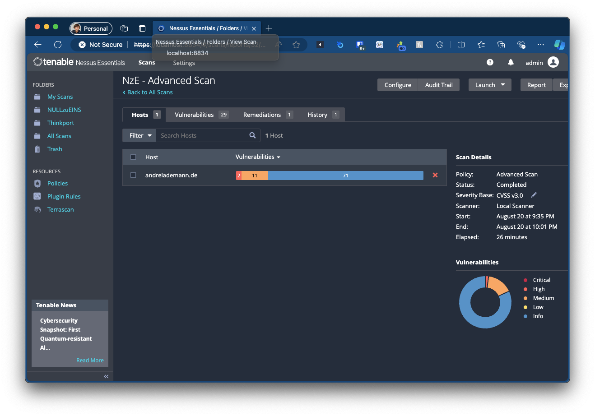

# Example Nessus Essentials

The Tenable Nessus is a vulnerability scanner that can be used to scan for vulnerabilities in your network. This example shows how to run Nessus in a container.



## Prerequisites

1. Docker
2. Create a Nessus Key on <https://www.tenable.com/downloads/nessus>

## Start with Docker cli

You can find more detailed information on the Nessus documentation page: <https://docs.tenable.com/nessus/Content/DeployNessusDocker.htm?Highlight=docker>.

### Run Nessus Vulnerability Scanner

Run with Docker Compose:

```bash
docker compose up -d
```

Run with Docker cli:

```bash
docker run --name "nessus-scanner" -d -p 8834:8834 -e USERNAME=admin -e PASSWORD=admin -e AUTO_UPDATE=all tenable/nessus:latest-ubuntu
```

## Configure Nessus Essentials

1. Open your browser and navigate to <http://localhost:8834>.
2. Select "Essentials" and click "Continue".
3. Enter your name and email address and click "Continue".
4. Copy and save the activation code and click "Continue".
5. Enter credentials and click "Continue"
6. **Wait up to 30 minutes** for the scanner to be activated.
7. Start your first scan.
